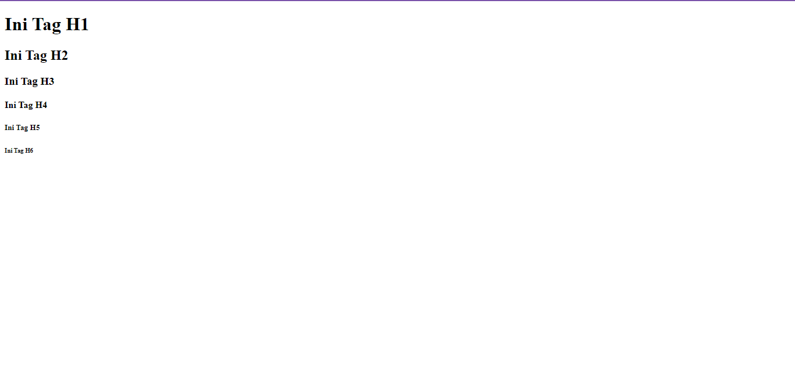

# TAG HEADING PADA HTML.

## APA ITU TAG HEADING? APA SAJA TAG HEADING ITU?

_Tag Heading_ adalah tag yang biasa digunakan untuk membuat heading / judul pada sebuah halaman website. Tag ini diawali dengan huruf _h_ dan diikuti dengan angka dari _1 - 6_ di depannya.

Adapun daftar tag heading pada HTML yaitu:

- `<h1>..</h1>`
- `<h2>..</h2>`
- `<h3>..</h3>`
- `<h4>..</h4>`
- `<h5>..</h5>`
- `<h6>..</h6>`

Adapun contoh penulisan kodenya adalah:

```html
<!DOCTYPE html>
<html lang="en">
  <head>
    <meta charset="UTF-8" />
    <meta http-equiv="X-UA-Compatible" content="IE=edge" />
    <meta name="viewport" content="width=device-width, initial-scale=1.0" />
    <title>Document</title>
  </head>
  <body>
    <h1>Ini Tag H1</h1>
    <h2>Ini Tag H2</h2>
    <h3>Ini Tag H3</h3>
    <h4>Ini Tag H4</h4>
    <h5>Ini Tag H5</h5>
    <h6>Ini Tag H6</h6>
  </body>
</html>
```

HASILNYA:


PENJELASAN:
Bisa dilihat pada gambar diatas, bahwa ukuran setiap tag itu berbeda-beda, dimulai dari yang terbesar yaitu `<h1></h1>` dan yang terkecil yaitu `<h6></h6>`. Oleh karena itu, jika anda ingin membuat isi dari sebuah konten teks itu memiliki ukuran yang besar, maka kalian dapat menggunakan tag `<h1></h1>` dan seterusnya.

\*CATATAN PENTING:
_Tag heading_ ini adalah tag yang di khususkan bagi sebuah teks, jadi isi dari tag heading ini harus berupa sebuah teks dan tidak bisa di isi oleh konten lainnya seperti gambar.

Nah, demikianlah penjelasan singkat tentang _tag heading_ pada HTML, saya harap anda dapat memahami dan juga mengerti bagaimana penggunaan dari tag ini.

Terimakasih...😊
