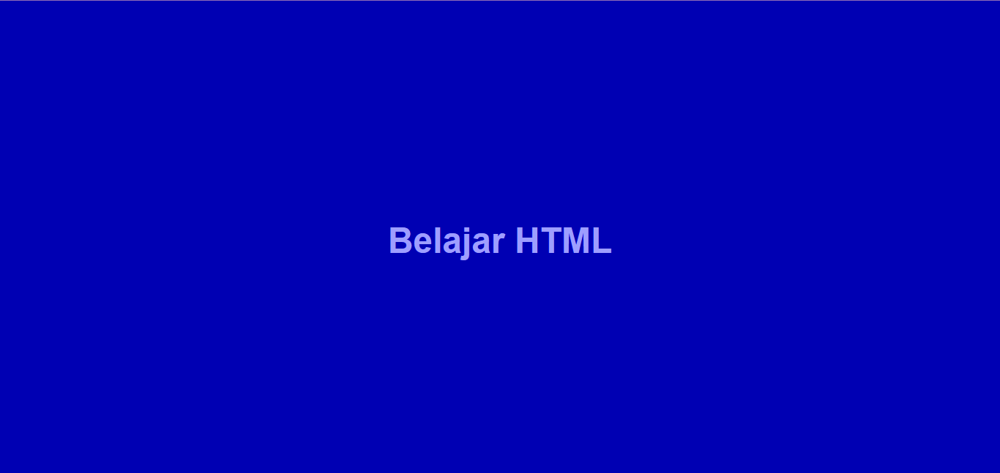

# APA ITU TAG IMG? UNTUK APA FUNGSINYA?

Ya, tag `` adalah sebuah tag khusus yang digunakan untuk menampilkan gambar pada _HTML_.
Tag ini memiliki 1 _atribut_ wajib yang harus ada di dalamnya yaitu `src` yang fungsinya adalah untuk memanggil nama file atau link dari gambar yang akan di tampilkan.

Adapun contoh kodenya adalah sebagai berikut:

```html
<!DOCTYPE html>
<html lang="en">
  <head>
    <meta charset="UTF-8" />
    <meta http-equiv="X-UA-Compatible" content="IE=edge" />
    <meta name="viewport" content="width=device-width, initial-scale=1.0" />
    <title>Document</title>
  </head>
  <body>
    
  </body>
</html>
```

HASILNYA:


### CATATAN:

_Cara diatas akan memanggil file gambar yang berada pada folder yang sama, jika antara file html dengan file gambarnya berbeda, maka cara penulisan kodenya menjadi ``_

Contoh:
``

_Artinya, kalian akan memanggil file `gambar.png` yang berada di dalam folder `gambar` untuk di tampilkan pada halaman website yang telah kalian buat. Selain itu, kalian juga dapat memanggil gambar yang berasal dari sumber lain yang ada di internet dan hal ini dapat di lakukan dengan cara menuliskan `link` dari gambar yang akan kalian ambil di dalam atribut `src`_

Contoh:
``

_Artinya dengan kalian mengetikkan kode diatas, maka kalian ingin menampilkan sebuah gambar dengan kategori `computer` dari yang bernama situs `unsplash` yang memiliki ukuran 40x40px_

\*Desclaimer:
Unsplash merupakan salah satu situs penyedia berbagai gambar menarik dari seluruh dunia yang bersifat `gratis`, jadi bagi kalian yang sedang membutuhkan gambar - gambar yang keren yang ingin di tampilkan pada website yang telah kalian buat, kalian bisa langsung mengunjugin situs .

# OH YA SATU LAGI!

Sebenarnya di dalam tag `img` ini ada satu lagi atribut tambahan yaitu atribut `alt` yang biasanya digunakan untuk menjelaskan secara singkat tentang gambar apa yang sedang di tampilkan.

Adapun cara penulisan kodenya adalah:
``

### Untuk apa fungsinya?

Ya, singkatnya atribut alt ini digunakan untuk menjelaskan tentang gambar yang akan ditampilkan pada sebuah website, dan salah satu kegunaanya adalah ketika gambar yang di panggil itu gagal untuk di tampilkan, maka halaman website kita akan menampilkan isi dari atribut `alt` tadi yaitu: `Gambar belajar HTML`. Jadi, walaupun terlihat sepele dan penggunaanya tidak lah wajib, alangkah baiknya kalian tetap menggunakan dan mengisi atribut `alt` ini pada website yang kalian buat.

Nah, demikianlah penjelasan singkat mengenai apa itu tag img pada html, bagaimana cara penulisannya dan digunakan untuk apa saja tag ini. Saya harap dengan adanya penjelasan ini kalian akan semakin mudah memahami penggunaan tag img ini dan membuat kalian jadi semakin giat untuk belajar HTML.

Terimakasih dan selamat belajar...😊
