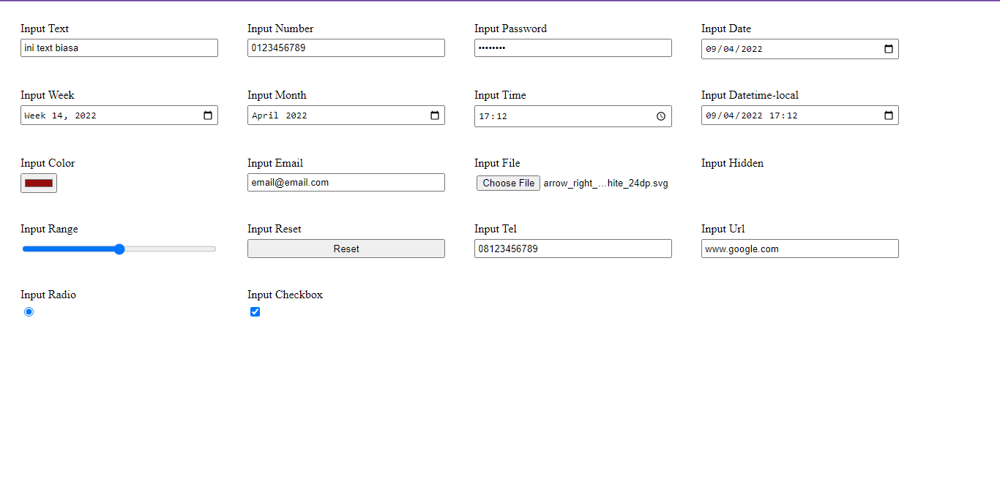

# APA ITU TAG INPUT?

_Tag input_ adalah sebuah teg yang biasa digunakan untuk menangkap / mengambil inputan dari user.

# BAGAIMANA CARA PENULISANNYA?

Adapun penulisan kode dari tag input ini adalah:
`<input type="text">`

\*Catatan:
_Tag input_ ini adalah salah satu tag yang tidak memiliki penutup sama halnya seperti tag _img._ jadi, anda cukup menuliskan kode `<input type="text">` saja dan bukan menuliskan `<input type="text"></input>`.

# KOK DI TAG INPUT ADA ATRIBUT TYPE? ITU FUNGSINYA UNTUK APA? DAN APAKAH TYPENYA HANYA "TEXT"?

Ya, atribut _type_ itu untuk menandakan jenis inputan apa yang boleh dimasukkan oleh user. Adapun untuk _type - typenya_ sediri ada:

- `text` = Inputan ini akan mengubah apapun yang di ketikkan oleh user menjadi karakter huruf termasuk angka sekalipun.
- `number` = Inputan ini hanya boleh di isi angka.
- `password` = Inputan ini akan mengubah apapun yang user masukkan menjadi karakter bulat seperti password.
- `date` = Inputan akan menampilkan sebuah _pop up box_ yang berisi tanggal, bulan dan tahun yang dapat anda pilih.
- `week` = Inputan akan menampilkan sebuah _pop up box_ yang berisi minggu.
- `month` = Inputan akan menampilkan sebuah _pop up box_ yang berisi bulan.
- `datetime-local` = Inputan ini akan menampilkan sebuah _pop up box_ yang berisi tanggal, bulan, tahun, jam dan menit yang dapat anda pilih sekaligus.
- `color` = Inputan ini akan menampilkan sebuah _pop up box_ yang menampilkan berbagai warna yang dapat anda pilih.
- `email` = Inputan ini hanya boleh di isi oleh email dengan format yang benar.
- `file` = Inputan ini dapat memilih file berformat apapun yang sudah di pilih.
- `hidden` = Inputan ini akan membuat sebuah inputan menjadi tidak terlihat oleh user.
- `range` = Inputan ini akan menampilkan sebuah slider seperti progress bar.
- `radio` = Inputan ini berbentuk bulat yang dimana user hanya boleh memilih satu pilihan saja (jika anda pernah melihat sistem e-learning yang menampilkan berbagai soal berbentuk pilihan ganda yang hanya bisa di pillih satu oleh user, maka pilihan gandanya itu memakai input type radio ini).
- `checkbox` = Inputan ini akan berbentuk sebuah kotak kecil yang dapat dipilih (hampir sama seperti radio, namun untuk input type checkbox ini user boleh memilih berbagai pilihan yang ada sekaligus / tidak hanya satu pilihan saja).
- `reset` = Inputan ini akan mengembalikan value / nilai yang di inputkan oleh user menjadi nilai default yang telah di tetapkan oleh user (contoh: inputan 'a' memiliki nilai bawaan "halo", ketika user memasukkan nilai "halo user" pada inputan 'a' lalu 'mengklik' input type reset ini, maka isi dari inputan a tadi akan berubah menjadi "halo").
- `search` = Inputan ini biasa digunakan untuk mencari sebuah data yang telah disediakan oleh sistem.
- `tel` = Inputan ini biasa digunakan untuk memasukkan sebuah nomer telepon.
- `url` = Inputan ini khusus digunakan untuk memasukkan nilai berupa sebuah link seperti _www.facebook.com_.

Banyak sekali bukan? Ya, itulah daftar type inputan yang ada pada HTML, adapun untuk contoh kodenya adalah sebagai berikut:

```html
<!DOCTYPE html>
<html lang="en">
  <head>
    <meta charset="UTF-8" />
    <meta http-equiv="X-UA-Compatible" content="IE=edge" />
    <meta name="viewport" content="width=device-width, initial-scale=1.0" />
    <title>Document</title>
    <style>
      div {
        display: flex;
        flex-direction: column;
        margin: 20px 0;
        width: 20%;
        padding: 0 20px;
      }

      label {
        margin-bottom: 5px;
      }

      body {
        display: flex;
        flex-wrap: wrap;
      }

      input {
        padding: 0.2rem;
        outline: none;
      }
    </style>
  </head>
  <body>
    <div>
      <label for="">Input Text</label>
      <input type="text" placeholder="input text" />
    </div>
    <div>
      <label for="">Input Number</label>
      <input type="number" />
    </div>
    <div>
      <label for="">Input Password</label>
      <input type="password" placeholder="input password" />
    </div>
    <div>
      <label for="">Input Date</label>
      <input type="date" />
    </div>
    <div>
      <label for="">Input Week</label>
      <input type="week" />
    </div>
    <div>
      <label for="">Input Month</label>
      <input type="month" />
    </div>
    <div>
      <label for="">Input Time</label>
      <input type="time" />
    </div>
    <div>
      <label for="">Input Datetime-local</label>
      <input type="datetime-local" />
    </div>
    <div>
      <label for="">Input Color</label>
      <input type="color" />
    </div>
    <div>
      <label for="">Input Email</label>
      <input type="email" />
    </div>
    <div>
      <label for="">Input File</label>
      <input type="file" />
    </div>
    <div>
      <label for="">Input Hidden</label>
      <input type="hidden" />
    </div>
    <div>
      <label for="">Input Range</label>
      <input type="range" />
    </div>
    <div>
      <label for="">Input Reset</label>
      <input type="reset" />
    </div>
    <div>
      <label for="">Input Tel</label>
      <input type="tel" pattern="[0-9]{3}-[0-9]{2}-[0-9]{3}" />
    </div>
    <div>
      <label for="">Input Url</label>
      <input type="url" />
    </div>
    <div>
      <label for="">Input Radio</label>
      <input type="radio" />
    </div>
    <div>
      <label for="">Input Checkbox</label>
      <input type="checkbox" />
    </div>
  </body>
</html>
```

DAN HASILNYA ADALAH:


Nah, demikianlah penjelasan tentang apa itu tag input, untuk apa fungsinya, apa saja type-type yang ada di dalamnya dan bagaimana penulisan kodenya. Saya harap dengan materi ini kalian dapat memahami tentang tag input di HTML dan membuat kalian jadi semakin giat dalam mempelajari HTML.

Terimakasih dan selamat belajar...😊
